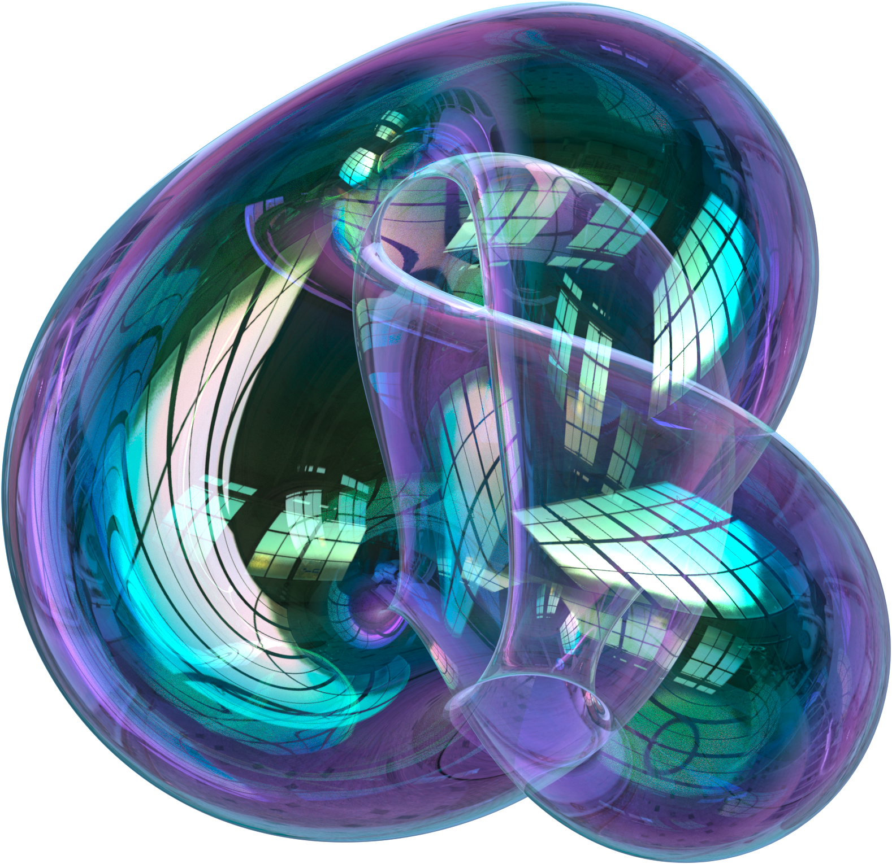

# 3ds Max Boy’s-Surface Generator

[](LICENSE.md)


> **No post-processing was used!**

> **One line of Python → a watertight, Möbius-correct mesh of the real projective plane**  
> Built for Autodesk **3ds Max 2025+** (Python 3.11, NumPy, Arnold).

---

## Features

| What                         | Why it matters                                                                  |
| ---------------------------- | ------------------------------------------------------------------------------- |
| **Single-slider resolution** | `resolution=N` adds rings _and_ longitudes – no manual counting.                |
| **True Möbius edge**         | Outer ring is paired with a half-turn twist – no Max “weld” hacks.              |
| **Vectorised NumPy core**    | ≈ 100 × quicker than nested loops – instant in IPR.                             |
| **Ready for Max workflow**   | Editable Poly, quad-ified, centred pivot, smoothing group #1.                   |
| **Friendly licence**         | CC BY-NC 4.0 – personal / academic use is free; commercial licences on request. |

---

## Folder layout (what’s in here and why?)

```
boys_surface_repo/
│
│  .gitignore           ← keeps temporary / IDE files out of Git
│  LICENSE.md           ← CC BY-NC 4.0 terms (read this before commercial use)
│  README.md            ← you are here
│
├─ boy_surface/         ← “engine room” – the Python that builds the mesh
│   ├─ __init__.py      (makes the folder importable; no need to open)
│   └─ boy_surface.py   ← run this in 3ds Max to create the surface
│
├─ demo/                ← ready-made sample assets
│   ├─ Boy_s Surface8.max       ← sample .max scene with the mesh loaded
│   ├─ boys_demo.png            ← hero render used in the README
│   ├─ boys_demo.exr            ← full-float version (for compositing tests)
│   ├─ boys_demo_2.png          ← alt lighting/render example
│   └─ boys_demo_2.exr          ← full-float of the alt render
│
└─ docs/                ← extra reading
    └─ README_docs.md   (placeholder – drop technical notes or PDFs here)
```

---

## Quick start

1. **Clone the repo**
    ```bash
    git clone https://github.com/your-user/boys_surface.git
    cd boys_surface
    ```

2. **Open the script in Max**
   `Scripting ▸ Open Script…` → `boy_surface/boy_surface.py`

3. **(Optional) Tweak resolution**

|        resolution |  verts |  faces |
| ----------------: | -----: | -----: |
|              `32` |   ~8 k |  ~16 k |
|              `64` |  ~32 k |  ~65 k |
| `128` _(default)_ | ~128 k | ~260 k |
|             `256` | ~512 k |   ~1 M |
|             `512` |   ~2 M | ~4.2 M |

4. **Run** `[Ctrl] + [E]` (Cmd + E on macOS VM).

A new mesh called **Boy's Surface** appears at the origin, ready for materials.

---

## Script parameters

| Parameter              | Type    | Default | What it does                                                            |
| ---------------------- | ------- | ------- | ----------------------------------------------------------------------- |
| `resolution`           | `int`   | `64`    | Radial ring count. The script sets `n_phi = round(ratio × resolution)`. |
| `ratio` (keyword-only) | `float` | `2.0`   | Angular-to-radial ratio – **must yield an even `n_phi`**.               |

---

## Rendering guide (Arnold)

_[Autodesk’s official Thin‑Film “Soap Bubble” settings (2025 Help)](https://help.autodesk.com/view/ARNOL/ENU/?guid=arnold_user_guide_ac_standard_surface_ac_standard_thinfilm_html)_

```text
Base Weight.................. 0
Specular Weight.............. 1
Specular IOR................. 1.0
Specular Roughness........... 0
Transmission Weight.......... 1
Coat Weight.................. 1
Coat IOR..................... 1.5
Thin‑Film Thickness.......... 500 nm
Thin‑Film IOR................ 1.4
Thin‑Walled.................. ON
```

---

## Acknowledgements

-   **Sean / Inform Studio** – original Blender prototype
    [https://inform.studio/blog/rendering-boys-surface-in-blender/](https://inform.studio/blog/rendering-boys-surface-in-blender/)
-   NumPy, Autodesk Arnold, 3ds Max 2025 Python bridge
-   HDRIs for demo rendering from [Poly Haven](https://polyhaven.com/hdris)

---

## License

**Creative Commons – CC BY-NC 4.0**
© 2025 **Philipp Reuter** ([reuter.philipp@ymail.com](mailto:reuter.philipp@ymail.com)) & **ChatGPT (o3)**.
Commercial use? → get in touch.
